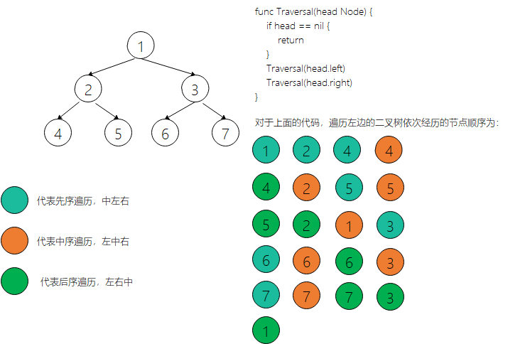

# 1. 线性表

线性表是具有n个**相同类型元素**的有限**序列**（n >=0）


> 其中`a1`是首节点（首元素），`an`是尾节点（尾元素）；
>
> `a1`是`a2`的前驱，`a2`是`a1`的后继

常见的线性表有：

* 数组
* 链表
* 栈
* 队列
* 哈希表（散列表）

## 1.1 数组（Array）

数组是一种顺序存储的线性表，所有元素的内存地址是连续的。比如，下面是go语言中声明以及初始化一个数组的示例：

```go
var array [3]int = [3]int{11, 12, 13}
```

其在内存存储的示意图如下所示：


在很多编程语言中，数组都有个致命的缺点：**无法动态修改容量**，go语言中的数组也不例外，在实际开发中，更希望数组的容量是可以动态改变的。

go语言中为我们提供了一种`slice`数据类型，可以动态对数组进行的扩容。在`slice`的基础上我们再次封装构建一个可以动态增长的`ArrayList`。

### 1.1.2 数组的性能分析

> 查找元素
>
> `O(1)`
>
> 添加元素
>
> `O(N)`
>
> 删除元素
>
> `O(N)`

### 1.1.3 接口以及ArrayList结构设计

接口设计：

```go
type List interface {
    Size() int   // 数组大小
    Get(index int) (interface{}, error)  // 获取第几个元素
    Set(index int, newval interface{}) error  // 修改指定索引位置的元素
    Insert(index int, newval interface{}) error  // 插入元素
    Append(data interface{})  // 追加元素
    Clead()  // 清空
    Delete(index int) error  // 删除
    String() string  // 返回字符串
}
```

`ArrayList`结构设计：

```go
type ArrayList struct {
    dataStore []interface{}  // 数据存储
    theSize int  // 数组的大小
}
```

>  `ArrayList`的结构示意图如下：
>
> 

### 1.1.4 ArrayList实现List接口

```go
package ArrayList

import (
	"errors"
	"fmt"
)

type List interface {
	Size() int  // 数组的大小
	Get(index int) (interface{}, error)  // 获取第几个元素
	Set(index int, newval interface{}) error  // 修改指定索引位置的数据
	Insert(index int, newval interface{}) error  // 插入数据
	Append(newval interface{})   // 追加
	Clear()   // 清空
	Delete(index int) error  // 删除
	String() string  // 返回字符串
}

type ArrayList struct {
	dataStore []interface{}   // 数组存储
	theSize int  // 数组的大小
}

func NewArrayList() *ArrayList {
	list := new(ArrayList)  // 初始化结构体
	list.dataStore = make([]interface{}, 0, 10)  // 开辟空间10个
	list.theSize = 0
	return list
}

func (list *ArrayList) Size() int {
	return list.theSize   // 返回数组大小
}

func (list *ArrayList) Get(index int) (interface{}, error) {
	if index < 0 || index >= list.theSize {
		return nil, errors.New("索引越界")
	}
	return list.dataStore[index], nil
}

func (list *ArrayList) Append(newval interface{}) {
	list.dataStore = append(list.dataStore, newval)  // 叠加数据
	list.theSize++
}

func (list *ArrayList) String() string {  // 返回数组的字符串
	return fmt.Sprint(list.dataStore)
}

func (list *ArrayList) Set(index int, newval interface{}) error {
	if index < 0 || index >= list.theSize {
		return errors.New("索引")
	}

	list.dataStore[index] = newval
	return nil
}

func (list *ArrayList) checkisFull() {
	if list.theSize == cap(list.dataStore) {
		// make 中间的参数为0，表示没有开辟空间
		newdataStore := make([]interface{}, 2*list.theSize, 2*list.theSize)
		//copy(newdataStore, list.dataStore)
		for i := 0; i < list.theSize; i++ {
			newdataStore[i] = list.dataStore[i]
		}
		list.dataStore = newdataStore
	}
}

func (list *ArrayList) Insert(index int, newval interface{}) error {
	if index < 0 || index >= list.theSize {
		return errors.New("索引越界")
	}
	list.checkisFull()  // 检测内存，如果满了，自动增加
	list.dataStore = list.dataStore[:list.theSize+1]  // 插入数据，内存移动一位
	for i := list.theSize; i > index; i-- {  // 从后往前移动
		list.dataStore[i] = list.dataStore[i-1]
	}
	list.dataStore[index] = newval
	list.theSize++
	return nil
}

func (list *ArrayList) Clear() {
	/*
		go语言有自己的垃圾回收机制，所以只需覆盖掉之前开辟的空间，
		重新开辟一个空间
	*/
	list.dataStore = make([]interface{}, 0, 10)
	list.theSize = 0
}

func (list *ArrayList) Delete(index int) error {
	if index < 0 || index >= list.theSize {
		return errors.New("索引越界")
	}

	list.dataStore = append(list.dataStore[:index], list.dataStore[index+1:]...)  // 重新叠加，跳过index索引
	list.theSize--
	return nil
}
```

```go
// for test 
func main() {

	arrayList := ArrayList.NewArrayList()
	arrayList.Append("a1")
	arrayList.Append("a2")
	arrayList.Append("a3")
	arrayList.Append("a4")
	arrayList.Delete(1)
	fmt.Println(arrayList)
}
```

### 1.1.5 数组的迭代器实现

在上面所实现的方法中，可以发现，对数组中的访问过程还是不方便。于是我们可以对在`ArrayList`结构的基础上，在为其封装一个指针，该指针指向可以指向`ArrayList`中的任意一个元素。

迭代器的接口设计：

```go
/*
	迭代器主要是解决访问数组方便的问题
*/
type Iterator interface {
	HasNext() bool  // 是否有下一个
	Next() (interface{}, error)  // 下一个
	Remove()  // 删除
	GetIndex() int  // 得到索引
}
```

可迭代接口的设计：

```go
type Iterative interface {
	Iterator() Iterator   // 构造初始化接口
}
```

可迭代数组结构设计：

```go
type ArraylistIterator struct {
	list *ArrayList   // 数组指针
	currentIndex int  // 当前索引
}
```

构造迭代器：

```go
func (list *ArrayList) Iterator() Iterator {
	it := new(ArraylistIterator)   // 构造迭代器
	it.currentIndex = 0
	it.list = list
	return it
}
```

`ArraylistIterator`实现`Iterator`接口：

```go 
func (it *ArraylistIterator) HasNext() bool {
	if it.currentIndex < it.list.theSize {
		return true
	}
	return false
}
func (it *ArraylistIterator) Next() (interface{}, error) {
	if !it.HasNext() {
		return nil, errors.New("没有下一个")
	}
	value, err := it.list.Get(it.currentIndex)  // 获取当前数据
	it.currentIndex++
	return value, err
}
func (it *ArraylistIterator) Remove() {
	it.currentIndex--
	it.list.Delete(it.currentIndex)   // 删除一个元素
}
func (it *ArraylistIterator) GetIndex() int {
	return it.currentIndex
}
```

```go
func main() {
	// 定义接口对象，赋值的对象必须实现接口的所有方法
	var list ArrayList.List = ArrayList.NewArrayList()
	list.Append("a1")
	list.Append("b2")
	list.Append("c3")
	list.Append("d4")
	list.Append("f5")
	for it := list.Iterator(); it.HasNext(); {
		item, _ := it.Next()
		fmt.Println(item)
	}
}
```

使用迭代器的好处，我们可以在更高层进行封装，比如说：在`Next()`方法中可以增加一个`string`类型的参数，每次在调用`Next()`可以对传出的参数是否匹配进行判断，如果符合条件就可访问之后的操作，相当于一个权限的管理机制。

## 1.2 栈

栈是一种特殊的线性结构，只能在**一端**进行操作。

### 1.2.1 栈的性质

* 往栈中添加元素的操作，一遍叫作`push`，**入栈**
* 从栈中移除元素的操作，一般叫作`pop`，**出栈**（只能移除栈顶元素，也叫作：弹出栈顶元素）
* 栈遵守先进后出的原则，`Last In First Out, LIFO`

栈以及入栈出栈操作的示意图如下：


### 1.2.2 栈的接口设计以及数组栈结构设计

栈接口设计：

```go
type StackArray interface {
	Clear()  // 清空
	Size() int  // 大小
	isEmpty() bool  // 是否满了
	isFull() bool  // 是否为空
	Push(data interface{})  // 压入
	Pop() interface{}  // 弹出
	Peek() interface{}  // 弹出栈顶元素
}
```

数组栈结构设计：

对于栈内部的数据结构的设计，可以使用go语言提供的`slice`的数据结构，还可以使用我们先前实现的`ArrayList`结构。首先先使用`slice`来实现：

```go
type Stack struct {
    dataSource []interface
   	capSize int // 最大范围
    currentSize int  // 实际使用大小
}
```

### 1.2.3 Stack实现StackArray接口

```go
// StackArray.go
func NewStack() *Stack {  // 构造函数，返回一个初始化的Stack结构体指针
   myStack := new(Stack)
   myStack.dataSource = make([]interface{}, 0, 10)
   myStack.capSize = 10
   myStack.currentSize = 0
   return myStack
}

func (s *Stack) Clear() {
   /*
      golang有其自己的垃圾回收机制。
      重新给dataSource开辟和原始相同的空间，将原始空间覆盖；
      并将capSize与currentSize赋值为最初的值
   */
   s.dataSource = make([]interface{}, 0, 10)
   s.capSize = 10
   s.currentSize = 0
}
func (s *Stack) Size() int {
   return s.currentSize
}
func (s *Stack) isEmpty() bool {
   if s.currentSize == 0 {
      return true
   } else {
      return false
   }
}
func (s *Stack) isFull() bool {
   if s.currentSize == s.capSize {
      return true
   } else {
      return false
   }
}

func (s *Stack) Push(data interface{})  {
   if !s.isFull() {
      s.dataSource = append(s.dataSource, data)
      s.currentSize++
   }
}

func (s *Stack) Pop() interface{} {
   if !s.isEmpty() {
      data := s.dataSource[s.currentSize-1]
      s.dataSource = s.dataSource[:s.currentSize-1]
      s.currentSize--
      return data
   }
   return nil
}

func (s *Stack) Peek() interface{} {
   if !s.isEmpty() {
      return s.dataSource[s.currentSize]
   }
   return nil
}
```

### 1.2.4 使用ArrayList实现Stack

```go
// ArrayListStack.go
package ArrayList

type StackArray interface {
	Clear()  // 清空
	Size() int  // 大小
	isEmpty() bool  // 是否满了
	isFull() bool  // 是否为空
	Push(data interface{})  // 压入
	Pop() interface{}  // 弹出
	Peek() interface{}  // 弹出栈顶元素
}

type Stack struct {
	dataSource *ArrayList
	capSize int  // 最大范围
}

func NewStack() *Stack {
	myStack := new(Stack)
	myStack.dataSource = NewArrayList()
	myStack.capSize = 10
	return myStack
}

func (s *Stack) Clear() {
	/*
		golang有其自己的垃圾回收机制。
		重新给dataSource开辟和原始相同的空间，将原始空间覆盖；
		并将capSize与currentSize赋值为最初的值
	*/
	s.dataSource.Clear()
	s.capSize = 10
}
func (s *Stack) Size() int {
	return s.dataSource.theSize
}
func (s *Stack) isEmpty() bool {
	if s.dataSource.theSize == 0 {
		return true
	} else {
		return false
	}
}
func (s *Stack) isFull() bool {
	if s.dataSource.theSize == s.capSize {
		return true
	} else {
		return false
	}
}

func (s *Stack) Push(data interface{})  {
	if !s.isFull() {
		s.dataSource.Append(data)
	}
}

func (s *Stack) Pop() interface{} {
	if !s.isEmpty() {
		data, _ := s.dataSource.Get(s.dataSource.theSize-1)
		s.dataSource.Delete(s.dataSource.theSize-1)
		return data
	}
	return nil
}

func (s *Stack) Peek() interface{} {
	if !s.isEmpty() {
		return s.dataSource.dataStore[s.dataSource.theSize]
	}
	return nil
}

```

### 1.2.5 使用迭代器实现Stack

```go
// ArrayListIteratorStack.go
type StackArrayX interface {
	Clear()  // 清空
	Size() int  // 大小
	isEmpty() bool  // 是否满了
	isFull() bool  // 是否为空
	Push(data interface{})  // 压入
	Pop() interface{}  // 弹出
	Peek() interface{}  // 弹出栈顶元素
}

type StackX struct {
	dataSource *ArrayList
	MyIt Iterator
}

func NewStackX() *StackX {
	myStack := new(StackX)
	myStack.dataSource = NewArrayList()
	myStack.MyIt = myStack.dataSource.Iterator()  // 迭代
	return myStack
}

func (s *StackX) Clear() {
	/*
		golang有其自己的垃圾回收机制。
		重新给dataSource开辟和原始相同的空间，将原始空间覆盖；
		并将capSize与currentSize赋值为最初的值
	*/
	s.dataSource.Clear()
	s.dataSource.theSize = 0
}
func (s *StackX) Size() int {
	return s.dataSource.theSize
}
func (s *StackX) isEmpty() bool {
	if s.dataSource.theSize == 0 {
		return true
	} else {
		return false
	}
}
func (s *StackX) isFull() bool {
	if s.dataSource.theSize >= 10 {
		return true
	} else {
		return false
	}
}

func (s *StackX) Push(data interface{})  {
	if !s.isFull() {
		s.dataSource.Append(data)
	}
}

func (s *StackX) Pop() interface{} {
	if !s.isEmpty() {
		data, _ := s.dataSource.Get(s.dataSource.theSize-1)
		s.dataSource.Delete(s.dataSource.theSize-1)
		return data
	}
	return nil
}

func (s *Stack) Peek() interface{} {
	if !s.isEmpty() {
		return s.dataSource.dataStore[s.dataSource.theSize]
	}
	return nil
}
```

```go
// for test 
func main() {
	myStack := ArrayList.NewStackX()
	myStack.Push(1)
	myStack.Push(2)
	myStack.Push(3)
	myStack.Push(4)
	//fmt.Println(myStack.Pop())
	//fmt.Println(myStack.Pop())
	//fmt.Println(myStack.Pop())
	//fmt.Println(myStack.Pop())
	//fmt.Println(myStack.Pop())
	// 使用迭代器遍历栈中的元素
	for it := myStack.MyIt; it.HasNext(); {
		item, _ := it.Next()
		fmt.Println(item)
	}
}
```

### 1.2.6 栈的应用

#### 栈模拟递归

【要求】使用递归实现对一个**数的叠加**。

> 例如，输入一个5
>
> 输出 `5 + 4 + 3 + 2 + 1`的值

【代码实现】

```go
func Add(num int) int {
    if num ==  0 {
        return 0
    } else {
        return num + Add(num - 1)
    }
}
```

【栈模拟递归实现】

> 思路：
>
> * 初始化一个栈结构
> * 将`num`先压入栈中；
> * 循环开始：如果栈不为空执行下面步骤
>   * 弹出栈顶元素，判断其是否是0，
>   * 如果为0：
>     	sum += 0
>   * 如果不为0：
>     	sum + pop()，然后将`num-1`的数压入栈中
>   * 最后返回sum

```go
// 使用栈模拟递归
func Add1(num int) int {
	myStack := StackArray.NewStack()
	sum := 0  // 记录结果
	myStack.Push(num)

	for !myStack.IsEmpty() {
		data := myStack.Pop()
		if data == 0 {
			sum += 0
		} else {
			sum += data.(int)
			myStack.Push(data.(int) - 1)
		}
	}
	return sum
}
```

【要求】斐波那契（Fibonacci）数列的实现。

> 例如输入10，输出10对应的斐波那契数列。

【代码实现】

```go
func Fibonacci(num int) int {
	// 递归实现
	if num == 1 || num == 2 {
		return 1
	}
	return Fibonacci(num - 1) + Fibonacci(num - 2)
}

func main() {
	fmt.Println(Fibonacci(9))
}
```

【栈模拟递归实现】

```go
func Fibonacci1(num int) int {
	mystack := StackArray.NewStack()
	mystack.Push(num)
	last := 0
	for !mystack.IsEmpty() {
		data := mystack.Pop()
		if data == 1 || data == 2 {
			last += 1
		} else {
			mystack.Push(data.(int) - 2)
			mystack.Push(data.(int) - 1)
		}
	}
	return last
}
```

#### 文件目录显示

【要求】给出一个`path`路径，显示该路径下的所有目录以及文件。

> 使用**递归**实现的思路：
>
> 主程序，初始化一个路径以及字符串切片，作为一个函数`GetAll(path string, files []string) ([]string, error)`的参数，该函数返回一个字符串切片，该切片中存储了指定路径下的所有文件以及目录。通过遍历该字符串切片，显示指定路径下的所有文件及目录。
>
> `GetAll()`函数实现：
>
> 首先使用`ioutil.ReadDir`读取给定的路径，遍历返回值`read`：
>
> ​	如果为目录，构造新的路径，并将新的路径添加到`[]string`中，然后调用`GetAll()`函数递归遍历新路径下的文件；
>
> ​	如果为文件，构造新的路径，将其添加到`[]string`中即可。

```go 
import (
	"errors"
	"fmt"
	"io/ioutil"
)

func GetAll(path string, files []string) ([]string, error) {
	read, err := ioutil.ReadDir(path)
	if err != nil {
		return files, errors.New("文件夹不可读取")
	}

	for _, fi := range read {
		if fi.IsDir() {
			path := path + "\\" + fi.Name()
			files = append(files, path)
			files, _ = GetAll(path, files)
		} else {
			path := path + "\\" + fi.Name()
			files = append(files, path)
		}
	}
	return files, nil
}

func main() {
	path := "D:\\Downloads"
	files := []string{}
	files, _ = GetAll(path, files)

	for i := 0; i < len(files); i++ {
		fmt.Println(files[i])
	}
}
```

> 使用**栈模拟递归**实现：
>
> 将给定的`path`压入到栈中。
>
> 只要栈不为空一直循环：
>
> ​	弹出栈顶的元素，判断其是否为目录：
>
> ​		如果为目录，构建新的`path`将其添加到`[]string`中，并且将`path`压入栈中；
>
> ​		如果为非目录，构建新的`path`将其添加到`[]string`中
>
> 最后返回`[]string`。

【代码实现】

```go
func GetAll1(path string, files []string) ([]string, error) {
	myStack := StackArray.NewStack()
	myStack.Push(path)

	for !myStack.IsEmpty() {
		tmpPath := myStack.Pop().(string)
		read, err := ioutil.ReadDir(tmpPath)  // 读取文件夹下面所有的路径

		if err != nil {
			return files, errors.New("文件夹不可读取")
		}

		for _, fi := range read {
			if fi.IsDir() {
				path := tmpPath + "\\" + fi.Name()  // 构造新的路径
				files = append(files, path)  // 追加路径
				myStack.Push(path)
			} else {
				path := tmpPath + "\\" + fi.Name()  // 构造新的路径
				files = append(files, path)  // 追加路径
			}
		}
	}
	return files, nil
}
```

## 1.3 队列

**队列**是一种特殊的线性表，只能在**头尾两端**进行操作。

### 1.3.1 队列的性质

* **队尾**（rear）：只能从**队尾添加**元素，一般叫作`enQueue`，**入队**
* **队头**（front）：只能从**队头移除**元素，一般叫作`deQueue`，**出队**
* 队列遵循先进先出的原则，`First In First Out, FIFO`

队列的示意图如下：


### 1.3.2 队列的接口以及数组队列结构设计

```go
type MyQueue interface {
	Size() int  // 大小
	Front() interface{}  // 返回队首元素
	End() interface{}  // 返回队列中的最后一个元素
	IsEmpty() bool  // 是否为空
	EnQueue(data interface{})  // 入队
	DeQueue() interface{}  // 出队
	Clear()  // 清空
}


type Queue struct {
	dataStore []interface{}  // 队列的数据存储
	theSize int   // 队列的大小
}
```

### 1.3.3 Queue实现MyQueue接口

```go
func NewQueue() *Queue {
	// 初始化一个Queue
	myQueue := new(Queue)
	myQueue.dataStore = make([]interface{}, 0)
	myQueue.theSize = 0
	return myQueue
}

func (q *Queue) Size() int {
	return q.theSize
}

func (q *Queue) Front() interface{} {
	if !q.IsEmpty() {
		return q.dataStore[0]
	}
	return nil
}

func (q *Queue) End() interface{} {
	if !q.IsEmpty() {
		return q.dataStore[q.theSize-1]
	}
	return nil
}

func (q* Queue) IsEmpty() bool {
	return q.Size() == 0
}

func (q *Queue) EnQueue(data interface{}) {
	q.dataStore = append(q.dataStore, data)
	q.theSize++
}

func (q *Queue) DeQueue() interface{} {
	if q.Size() == 0 {
		return nil
	}
	data := q.dataStore[0]
	if q.Size() > 1 {
		q.dataStore = q.dataStore[1:]
	} else {
		// 当队列有一个元素，此时需要出队，可以重新开辟一个数据存储空间
		q.dataStore = make([]interface{}, 0)
	}
	q.theSize--
	return data
}

func (q *Queue) Clear() {
	q.dataStore = make([]interface{}, 0, 10)
	q.theSize = 0
}
```

### 1.3.4 队列实现文件路径遍历

【思路】

> 将给定路径入队。
>
> 开始循环，如果队列不为空一直循环：
>
> ​	出队，得到一个路径，读取该路径下的所有内容；
>
> ​	遍历该路径下的内容：
>
> ​		判断其中的一个是否为目录：
>
> ​			如果是目录，构建新的路径，将其入队
>
> ​			如果是非目录，构建新的路径，将其保存至数组中

【代码实现】

```go
package main

import (
	"data_structure/Queue"
	"errors"
	"fmt"
	"io/ioutil"
)

func GetAll(path string, files []string) ([]string, error) {
	myQueue := Queue.NewQueue()
	myQueue.EnQueue(path)

	for  {
		path := myQueue.DeQueue()
		if path == nil {
			break
		}

		read, err := ioutil.ReadDir(path.(string))
		if err != nil{
			return files, errors.New("文件夹不可读取")
		}
		files = append(files, path.(string))

		for _, fi := range read {
			if fi.IsDir() {
				fileDir := path.(string) + "\\" + fi.Name()
				files = append(files, fileDir)
				myQueue.EnQueue(fileDir)
			} else {
				fileDir := path.(string) + "\\" + fi.Name()
				files = append(files, fileDir)
			}
		}
	}
	return files, nil
}

func main() {
	path := "D:\\Downloads"
	files := []string{}
	files, _ = GetAll(path, files)
	for i := 0; i < len(files); i++ {
		fmt.Println(files[i])
	}
	fmt.Println(len(files))
}

```

### 1.3.5 循环队列

上述过程实现的队列有一个缺点：当出队后，之后再入队就不能使用出队后省出的空间，于是对于底层固定容量的数组空间造成了浪费。循环队列的实现就能够充分的利用底层的空间。

循环队列的设计：

>两个指针：`front`指向队首，`rear`指向队尾
>
>当`front==rear`时，表示队列为空；
>
>当`front == rear+1`时，表示队列已满。
>
>`rear`指向的是下一次要入队的位置
>
>`front`指向的是出队时的数据

循环队列的实现：

```go
package CircleQueue

import (
	"errors"
)

const QueueSize = 100  // 最多存储QueueSize - 1个数据
// 空一格空格表示满格

type CircleQueue struct {
	data [QueueSize]interface{}  // 存储数据的结构
	front int  // 头部的位置
	rear int  // 尾部的位置
}

func InitQueue(q *CircleQueue) {
	// 初始化，头部尾部重合，为空
	q.front = 0
	q.rear = 0
}

func EnQueue(q *CircleQueue, data interface{}) (err error) {
	if (q.rear + 1) % QueueSize == q.front % QueueSize {
		return errors.New("队列已经满了")
	}

	q.data[q.rear] = data
	q.rear = (q.rear + 1) % QueueSize
	return nil
}

func DeQueue(q *CircleQueue) (data interface{}, err error) {
	if q.rear == q.front {
		return nil, errors.New("队列为空")
	}

	res := q.data[q.front]  // 取出队首元素
	q.data[q.front] = 0  // 清空数据
	q.front = (q.front + 1) % QueueSize  // 小于100 +1，101回到1的位置

	return res, nil
}

```

```go
// for test
func main() {
	var myq CircleQueue.CircleQueue
	CircleQueue.InitQueue(&myq)
	for i := 1; i <= 5; i++ {
		_ = CircleQueue.EnQueue(&myq, i)
	}
	fmt.Println(CircleQueue.DeQueue(&myq))
	fmt.Println(CircleQueue.DeQueue(&myq))
	fmt.Println(CircleQueue.DeQueue(&myq))
	fmt.Println(CircleQueue.DeQueue(&myq))	
	fmt.Println(CircleQueue.DeQueue(&myq))
}
```

 ## 1.4 链式栈和队列

在1.2和1.3中实现栈和队列使用的底层数据结构为数组，该方式实现都有哪些缺点呢？首先最大的缺点就是，使用数组实现的栈和队列在初始化时要初始化其容量大小，当数据量存储大于容量大小时，不能继续存储数据，所以在工程应用上的栈和队列不会使用数组作为底层结构，而会使用链表作为底层结构，基于链表实现的栈和队列理论上可以无限的扩容（只要你的物理内存允许）。所下面分别看下链式栈和队列的实现。

### 1.4.1 链式栈

**链式栈的结构与接口设计：**

```go
// 节点结构
type Node struct {
	data interface {}
	pNext *Node
}

type LinkStack interface {
	IsEmpty() bool
	Push(data interface{})
	Pop() interface{}
	Length() int
}
```

**`Node`实现`LinkStack`接口：**

```go
/*
	链表带头节点
	栈的实现方式：
	头插头删除
*/

func NewStack() *Node {
	return &Node{}  // 返回一个节点指针
}

func (n *Node) IsEmpty() bool {
	if n.pNext == nil {
		return true
	} else {
		return false
	}
}

func (n *Node) Push(data interface{}) {
	newNode := &Node{data, nil}
	newNode.pNext = n.pNext
	n.pNext = newNode  // 头部插入
}

func (n *Node) Pop() interface{} {
	if n.IsEmpty() {
		return nil
	} 
	data := n.pNext.data  // 保存第一个节点中的数据
	n.pNext = n.pNext.pNext  // 头部删除
	return data
}

func (n *Node) Length() int {
	cur := n.pNext
	length := 0
	for cur != nil {
		length++
		cur = cur.pNext
	}
	return length
}
```

```go
// for test
func main() {
	myStack := LinkStack.NewStack()
	fmt.Println(myStack.IsEmpty())

	myStack.Push(1)
	fmt.Println(myStack.IsEmpty())

	myStack.Push(2)
	myStack.Push(3)
	myStack.Push(4)

	fmt.Println(myStack.Length())

	fmt.Println(myStack.Pop())
	fmt.Println(myStack.Length())

	fmt.Println(myStack.Pop())
	fmt.Println(myStack.Pop())
	fmt.Println(myStack.Pop())
}
```

### 1.4.2 链式队列

**链式队列结构以及接口设计**

```go
type Node struct {
	data interface{}
	pNext *Node
}

type QueueLink struct {
	front *Node
	rear *Node
}

type LinkQueue interface {
	IsEmpty() bool
	Enqueue(data interface{})
	Dequeue() interface{}
	Length() int
}
```

**QueueLink实现LinkQueue接口**

```go
func (q *QueueLink) IsEmpty() bool {
	if q.front == nil {
		return true
	} else {
		return false
	}
}

func (q *QueueLink) Enqueue(data interface{}) {
	newNode := &Node{data, nil}
	if q.IsEmpty() {
		q.front = newNode
		q.rear = newNode
	} else {
		q.rear.pNext = newNode
		q.rear = q.rear.pNext
	}
}

func (q *QueueLink) Dequeue() interface{} {
	// 头部删除
	if q.IsEmpty() {
		return nil
	}
	data := q.front.data  // 记录头部位置
	if q.front == q.rear {  // 只剩一个
		q.front = nil
		q.rear = nil
	} else {
		q.front = q.front.pNext
	}
	return data
}

func (q *QueueLink) Length() int {
	cur := q.front
	length := 0
	for cur != nil {
		length++
		cur = cur.pNext
	}
	return length
}
```

```go
func main() {
	myQueue := LinkQueue.NewLinkQueue()
	fmt.Println(myQueue.IsEmpty())
	myQueue.Enqueue(1)
	myQueue.Enqueue(2)
	myQueue.Enqueue(3)
	myQueue.Enqueue(4)

	fmt.Println(myQueue.Dequeue())
	fmt.Println(myQueue.Dequeue())
	fmt.Println(myQueue.Dequeue())
	fmt.Println(myQueue.Dequeue())
}
```

# 二叉树

## 1 树（Tree）的基本概念

树这种数据结构在计算机中的数据存储中使用的很广泛，比如说文件系统中的目录结构，就是以树结构展示或者说遍历的。

如下图所示，这种有节点、根节点、父节点、子节点、兄弟节点的结构就是树结构，类似于倒着生长的树。当然，在一棵树中可以没有任何节点，称之为**空树**；一棵树中也可以只有一个节点，也就是只有根节点。


* 节点的**度**（degree）：子树的个数
* 树的**度**：所有节点度中的最大值
* **叶子**节点（leaf）：度为0的节点
* **非叶子**节点：度不为0的节点
* **层数**（level）：根节点在第1层，根节点的子节点在第2层，以此类推
* 节点的**深度**（depth）：从根节点到当前节点的唯一路径上的节点总数
* 节点的**高度**（height）：从当前节点到最远叶子节点的路径上的节点总数
* 树的**深度**：所有节点深度中的最大值
* 树的**高度**：所有节点高度的最大值
* 树的**深度**等于树的**高度**

## 2 二叉树（Binary Tree）

每个节点的**度**最大为2（最多拥有2棵子树），并且左子树和右子树是有顺序的的树称为**二叉树**。


### 2.1 二叉树的性质

* 非空二叉树的第i层，最多有`2的i-1次方`个节点，其中`i>=1`

* 在高度为h的二叉树上最多有`2的h次方-1`个节点，其中`h>=1`

* 对于任何一棵非空二叉树，如果叶子节点的个数为n0，度为2的节点个数为n2，则有：`n0 = n2 + 1`

  > 假设度为 1 的节点个数为 n1 ，那么二叉树的节点总数 `n= n0 + n1 + n2 `
  >
  > 二叉树的边数` T = n1 + 2 * n2 = n – 1 = n0 + n1 + n2 - 1 `
  >
  > 因此`n0 = n2 + 1`

### 2.2 真二叉树

所有节点的度要么为0，要么为2的二叉树为真二叉树。

 

### 2.3 满二叉树

满二叉树是最后一层是叶子节点，非叶子节点的两个孩子都全。如下图所示：


满二叉树的性质：假设满二叉树的高度为h（h>=1），那么：

* 第`i`层的节点数量：`2的i-1次方`
* 叶子节点数量：`2的h-1次方`
* 总结点数量n
  * n=2的h次方-1
  * h=log2(n+1)
* 在同样高度的二叉树中，满二叉树的叶子节点数量最多、总结点数量最多
* 满二叉树一定是真二叉树，真二叉树不一定是满二叉树


### 2.4 完全二叉树（Complete Binary Tree）

非满二叉树从左向右一次补齐形成的树为完全二叉树。如下图所示：


#### 完全二叉树的性质

* 度为1的节点只有左子树
* 度为1的节点要么是1个要么是0个
* 同样节点数量的二叉树，完全二叉树的高度最小
* 假设完全二叉树的高度为h（h>=1），那么
  * 至少有2的h-1次方个节点
  * 最多有2的h次方-1个节点
  * 总节点数为n
  * `h=floor(log2n)+1`，floor是向下取整，另外，ceiling是向上取整
* 一棵有n个节点的完全二叉树(n>0)，从上到下、从左到右对节点从0开始进行编号，对任意第i个节点
  * 如果`i=0`，则该节点为根节点
  * 如果`i>0`，它的父节点编号为`floor((i-1)/2)`
  * 如果`2i+1<=n`，它的左子节点编号为`2i`
  * 如果`2i+1>n`，它无左子节点
  * 如果`2i+2<=n`，它的右子节点编号为`2i+2`
  * 如果`2i+2>n`，它无右子节点

## 3 二叉树结构的实现

在介绍二叉树结构实现之前，我们先看如下需求：

> 在n个动态的整数中搜索某个整数？（查看其是否存在）
>
> 方案一：
>
> ​	假设使用动态数组存放元素，从第0个位置开始遍历搜索，平均时间复杂度为`O(n)`
>
> 方案二：
>
> ​	可以维护一个有序的动态数组，然后使用二分搜索，最坏的时间复杂度为`O(logn)`
>
> ​	但是添加、删除的平均时间复杂度为`O(n)`
>
> 那么在以上的方案中还有没有更好的方案？
>
> 使用二叉搜索树，添加、删除、搜索的最坏时间复杂度均可优化至`O(logn)`

### 3.1 二叉搜索树（Binary Search Tree）介绍

二叉搜索树是二叉树的一种，是应用非常广泛的一种二叉树，简称`BST`。

在二叉搜索树中任意一个节点的值都大于其左子树所有节点的值；任意一个节点的值都小于其右子树所有节点的值；任意一个节点的左右子树也是一棵二叉搜索树。

二叉搜索树可以大大提高搜索数据的效率。下图为一棵二叉搜索树。


### 3.2 二叉树的节点以及接口设计

二叉树的节点设计：

```go
type Node struct {
	data interface{}  // 存储的数据
	left *Node   // 左孩子节点
	right * Node  // 右孩子节点
	parent *Node  // 父节点
}
```

二叉树的接口设计：

```go
type BinaryTree interface {
	Size() int   // 元素的数量
	IsEmpty() bool  // 是否为空
	Clear()  // 清空所有元素
	Add(data interface{})  // 添加元素
	Remove(data interface{})  // 删除元素
	Contains(data interface{})  // 是否包含某元素
}

```

二叉树结构的设计：

```go
type Comparable func (i, j interface{}) int

type BST struct {
	root *Node
	size int
	comparable Comparable  // 自定义比较方案
}
```

### 3.3 添加结点

在如下二叉搜索树中添加1、12的节点：


> 添加步骤：
>
> 找到父节点parent；
>
> 创建新节点node；
>
> `parent.left = node`或者`parent.right = node`
>
> 当遇到值相等的元素建议覆盖旧的值。

代码示例：

```go
func (bst *BST) Add(data interface{}) {
	if bst.root == nil {
		bst.root = &Node{data, nil, nil, nil}
		bst.size++
		return
	}

	parent := bst.root
	node := bst.root
	cmp := 0

	for node != nil {
		cmp = bst.comparable(data, node.data)
		parent = node
		if cmp > 0 {
			node = node.right
		} else if cmp < 0 {
			node = node.left
		} else {  // 相等时，将旧值覆盖
			node.data = data
			return
		}
	}

	// 循环结束找到要添加位置的父节点，此时还要判断添加到父节点的左子树还是右子树
	newNode := &Node{data, nil, nil, parent}
	if cmp > 0 {
		parent.right = newNode
	} else {
		parent.left = newNode
	}
	bst.size++
}
```

### 3.4 二叉树的遍历

遍历是数据结构中的常见操作，当然二叉树也不例外，遍历是将所有元素都访问一遍。线性数据结构的遍历比较简单一般有正序遍历和逆序遍历。

对于二叉树来说，根据节点访问顺序的不同，二叉树的常见遍历方式有4种：

* 前序遍历（Preorder Traversal）
* 中序遍历（Inorder Traversal）
* 后序遍历（Postorder Traversal）
* 层序遍历（Level Order Traversal）

#### 3.4.1 前、中、后序遍历

##### 前序遍历

前序遍历访问元素的顺序是：根节点、前序遍历左子树、前序遍历右子树（中左右）


如上图所示，经过前序遍历所访问的节点为：

```go
7, 4, 2, 1, 3, 5, 9, 8, 11, 10, 12
```

##### 中序遍历

中序遍历访问元素的顺序是：中序遍历左子树、根节点、中序遍历右子树（左中右）；也可以是右左中

对于上图，经过中序遍历所访问的节点为：

```go
1, 2, 3, 4, 5, 7, 8, 9, 10, 11, 12
```

对于二叉搜索树进行中序遍历结果是升序或者降序

##### 后序遍历

后序遍历访问元素的顺序是：后序遍历左子树、后序遍历右子树、根节点（左右中）

对于上图，经过后序遍历所访问的节点为：

```go
1, 3, 2, 5, 4, 8, 10, 12, 11, 9, 7
```

#### 3.4.2 前、中、后序遍历递归实现

> 算法描述
>
> 先遍历整颗树的左子树，然后遍历整颗树的右子树；
>
> 此时整颗树上的节点会被访问三次；
>
> 在第一次访问所有节点为先序遍历；
>
> 在第二次访问所有节点为中序遍历；
>
> 在第三次访问所有节点为后序遍历。

```go
func Traversal(head Node) {
    if head == nil {
        return
    }
    Traversal(head.left)
    Traversal(head.right)
}
```



代码示例：

```go
// 前序遍历
func (bst *BST) PreOrderTraversal() {
	if bst.root == nil {
		return
	}
	bst.preOrderTraversal(bst.root)
}

func (bst *BST) preOrderTraversal(root *Node) {
	if root == nil {
		return
	}
	fmt.Printf("%v ", root.data)
	bst.preOrderTraversal(root.left)
	bst.preOrderTraversal(root.right)
}

// 中序遍历
func (bst *BST) InOrderTraversal() {
	if bst.root == nil {
		return
	}
	bst.inOrderTraversal(bst.root)
}

func (bst *BST) inOrderTraversal(root *Node) {
	if root == nil {
		return
	}
	bst.inOrderTraversal(root.left)
	fmt.Printf("%v ", root.data)
	bst.inOrderTraversal(root.right)
}

// 后序遍历
func (bst *BST) PostOrderTraversal() {
	if bst.root == nil {
		return
	}
	bst.postOrderTraversal(bst.root)
}

func (bst *BST) postOrderTraversal(root *Node) {
	if root == nil {
		return
	}
	bst.postOrderTraversal(root.left)
	bst.postOrderTraversal(root.right)
	fmt.Printf("%v ", root.data)
}
```

#### 3.4.3 前、中、后序遍历非递归实现

##### 前序遍历非递归实现

> 整体算法：
>
> 将根节点压入栈，弹出栈顶节点时，先向栈中压入栈顶节点的右孩子，再压入左孩子。
>
> 算法描述：
>
> cur = root
>
> 如果当前节点不为空，将压入栈中
>
> 循环执行以下操作，直到栈为空
>
> ​	弹出栈顶节点top，进行访问
>
> ​	如果`top.right`不为空，将其压入栈中
>
> ​	如果`top.left`不为空，将其压入栈中

```go
// 前序遍历
func (bst *BST) PreOrderTraversal() {
	bst.preOrderTraversal(bst.root)
}

func (bst *BST) preOrderTraversal(root *Node) {
	if root == nil {
		return
	}

	s := StackArray.NewStack()
	s.Push(root)

	for !s.IsEmpty() {
		cur := s.Pop().(*Node)
		fmt.Printf("%v ", cur.data)
		if cur.right != nil {
			s.Push(cur.right)
		}
		if cur.left != nil {
			s.Push(cur.left)
		}
	}
}

```

##### 中序遍历非递归实现

> 算法描述：
>
> 设置`cur = root`
>
> 如果栈不为空，或者cur不为空循环执行以下操作：
>
> ​	cur不为空，将cur压入栈中，cur往左
>
> ​	cur为空，弹出栈顶元素进行访问，cur往右

```go
// 中序遍历
func (bst *BST) InOrderTraversal() {
	bst.inOrderTraversal(bst.root)
}

func (bst *BST) inOrderTraversal(root *Node) {
	if root == nil {
		return
	}

	s := StackArray.NewStack()
	cur := root

	for cur != nil || !s.IsEmpty() {
		if cur != nil {
			s.Push(cur)
			cur = cur.left
		}else {
			cur = s.Pop().(*Node)
			fmt.Printf("%v ", cur.data)
			cur = cur.right
		}
	}
}
```

##### 后序遍历非递归实现

> 算法描述：
>
> 使用两个栈实现：
>
> 借助两个栈stack1和stack2；
>
> 首先先实现中右左的遍历；
>
> 将stack1弹出的节点压入stack2中；
>
> 最后弹出stack2中的所有元素。
>
> 
>
> 使用一个栈实现：
>
> 将`root`压入栈
>
> 循环执行以下操作，直到栈为空：
>
> ​	如果栈顶节点是叶子节点 或者 上一次访问的节点是栈顶节点的子节点，则弹出栈顶节点，进行访问；
>
> ​	否则，将栈顶节点的`right、left`按顺序入栈

代码示例：

```go
// 使用两个栈
func posOrderUnrecur(head *Node) {
	if head != nil {
		s1 := arraystack.New()
		s2 := arraystack.New()
		s1.Push(head)
		for !s1.Empty() {
			cur, _ := s1.Pop()
			s2.Push(cur)
			if cur.(*Node).left != nil {
				s1.Push(cur.(*Node).left)
			}
			if cur.(*Node).right != nil {
				s1.Push(cur.(*Node).right)
			}
		}
		for !s2.Empty() {
			tmp, _ := s2.Pop()
			fmt.Printf("%v ", tmp.(*Node).value)
		}
	}
	fmt.Println()
}

// 使用一个栈
func (bst *BST) PostOrderTraversal() {
	bst.postOrderTraversal(bst.root)
}

func (bst *BST) postOrderTraversal(root *Node) {
	if root == nil {
		return
	}
    
	s := StackArray.NewStack()

	lastVisitNode := new(Node)
	cur := root
	s.Push(root)

	// cur代表栈顶元素
	for !s.IsEmpty() && cur != nil {
		if (cur.left == nil && cur.right == nil) || (cur.left == lastVisitNode || cur.right == lastVisitNode) {
			node := s.Pop().(*Node)
			lastVisitNode = node
			fmt.Printf("%v ", node.data)

			if s.Peek() != nil {
				cur = s.Peek().(*Node)
			}
		} else {
			if cur.right != nil {
				s.Push(cur.right)
			}

			if cur.left != nil {
				s.Push(cur.left)
			}
			if s.Peek() != nil {
				cur = s.Peek().(*Node)
			}
		}

	}
}
```


#### 3.4.4 层序遍历

层序遍历访问元素的顺序是从上到下、从左到右一次访问每一个节点。


对于上图使用层序遍历依次访问的节点为：

```go
7, 4, 9, 2, 5, 8, 11, 1, 3, 10, 12
```

实现思路：使用队列

> 算法流程：
>
> 1. 将根节点入队
> 2. 循环执行以下操作，直到队列为空
>    1. 弹出队头节点A，进行访问
>    2. 将A的左子节点入队
>    3. 将A的右子节点入队

代码示例：

```go
// 层序遍历
func (bst *BST) LevelOrderTraversal() {
	bst.levelOrderTraversal(bst.root)
}

func (bst *BST) levelOrderTraversal(root *Node) {
   if root == nil {
      return
   }
   q := Queue.NewQueue()
   q.EnQueue(root)


   for !q.IsEmpty() {
      tmpNode := q.DeQueue()
      node := tmpNode.(*Node)
      fmt.Printf("%v ", node.data)

      if node.left != nil {
         q.EnQueue(node.left)
      }

      if node.right != nil{
         q.EnQueue(node.right)
      }
   }

}
```

#### 3.4.5 遍历的应用

* 前序遍历：树状结构展示（注意左右子树的顺序）
* 中序遍历：二叉搜索树的中序遍历按升序或降序处理节点
* 后序遍历：适用于一些先子后父的操作
* 层序遍历：计算二叉树的高度；判断一棵树是否为完全二叉树

##### 打印二叉树

```go
// 打印二叉树
func (bst *BST) String() string {
	var buffer bytes.Buffer   // 保存字符串
	bst.GenerateBSTString(bst.root, 0, "H", 17)
	return buffer.String()
}

func (bst *BST) GenerateBSTString(root *Node, depth int, to string, length int) {
	if root == nil {
		return
	}
	bst.GenerateBSTString(root.right, depth + 1, "v", length)
	val := to + strconv.Itoa(root.data.(int)) + to
	lenM := len(val)
	lenL := (length - lenM) / 2
	lenR := length - lenM - lenL
	val = bst.GenerateDepthString(lenL) + val + bst.GenerateDepthString(lenR)
	fmt.Println(bst.GenerateDepthString(depth * length) + val)
	bst.GenerateBSTString(root.left, depth+1, "^", length)
}

func (bst *BST) GenerateDepthString(depth int) string {
	var buffer bytes.Buffer
	for i := 0; i < depth; i++ {
		buffer.WriteString(" ")
	}
	return buffer.String()
}
```

### 3.5 删除节点

在二叉树中，其节点无非分为三类：度为0的节点（叶子节点）、度为1的节点、度为2的节点。所以在删除二叉树上的某一个节点的问题就分为：删除叶子节点、删除度为1的节点、删除度为2的节点。

#### 3.5.1 删除叶子节点

如下图的二叉搜索树，假如要删除10这个节点该如何删除？


> 首先，在二叉搜索树中先找到10这个节点
>
> 直接让3这个节点的父节点的左孩子指向空即可，也就是`node.parent.left = nil`

假如现在要删除3这个节点该如何删除？

>首先，在二叉搜索树中先找到3这个节点
>
>直接让3这个节点的父节点的右孩子指向空即可，也就是`node.parent.right = nil`

另外，在二叉树当中只有一个根节点时，只需将`root = nil`

删除叶子节点总结：

> 首先找到要删除的节点
>
> 如果`node.parent == nil`，`root = nil`
>
> 如果`node == node.parent.left`，`node.parent.left = nil`
>
> 如果`node == node.parent.right`，`node.parent.right = nil`

#### 3.5.2 删除度为1的节点

删除度为1的节点的核心思想是用子节点替代原节点的位置，其中`child`是`node.left`或者是`node.right`。如下图所示，比如要删除节点4和节点9，该如何删除？


> 如果node是左子节点：
>
> `child.parent = node.parent`
>
> `node.parent.left = child`
>
> 
>
> 如果node是右子节点：
>
> `child.parent = node.parent`
>
> `node.parent.right = child`
>
> 
>
> 如果node是根节点
>
> `root = child`
>
> `child.parent = nil`

#### 3.5.3 删除度为2的节点

删除二叉树上度为2的节点，那就必须找一个能够替换该节点的，并且还要保证二叉搜索树的性质，符合替换要删除的节点只能是该节点左子树上最大的数或者右子树上最小的数，也就是该节点的前驱或者后继。


> 删除度为2的节点的步骤：
>
> 先用前驱或者后继节点的值覆盖原节点的值
>
> 然后删除相应的前驱或者后继节点。
>
> 注意：
>
> 如果一个节点的度为2，那么它的前驱、后继节点的度只可能是1和0

#### 3.5.4 删除节点的代码实现

```go
// 带父节点指针的节点删除
func (bst *BST) Remove(node *Node) {
    if node == nil {
        return
    }
    bst.size--
    
    if node.left != nil && node.right != nil {
        // 要删除的节点的度为2
        s := bst.Successor(node)
        node.data = s.data
        node = s
    }
    
    // 此时node的度要么为1要么为0
    var replacement *Node
    if node.left != nil {
        replacement = node.left
    } else {
        replacement = node.right
    }
    
    if repalcement != nil {
        // node的度为1
        replacement.parent = node.parent
        
        if node.parent == nil {
            // node是度为1的根节点
            bst.root = replacement
        } else if node == node.parent.left {
            node.parent.left = replacement
        } else {
            node.parent.right = replacement
        }
        
        
    } else if node.parent == nil {
        // node是叶子节点并且是根节点
        bst.root = nil
    } else {
        // node是叶子但是不是根节点
        if node == node.parent.left {
            node.parent.left = nil
        } else {
            node.parent.right = nil
        }
    }
    
}
```

#### 3.5.5 递归删除节点


## 4 二叉树相关问题

### 4.1 翻转二叉树

https://leetcode-cn.com/problems/invert-binary-tree/


分别用递归、迭代（非递归）方式实现

> 思路：从题目中的要求可以看出，需要堆每个节点的左右子树进行交换，在这可以想到使用二叉树的遍历，在遍历的过程中去交换左右子树。所以，之前所有的遍历都可以用来解决此问题。以前序遍历为示例：

代码示例：

```go
/**
 * Definition for a binary tree node.
 * type TreeNode struct {
 *     Val int
 *     Left *TreeNode
 *     Right *TreeNode
 * }
 */
func invertTree(root *TreeNode) *TreeNode {
    if root == nil {
        return root
    }

    root.Left, root.Right = root.Right, root.Left
    invertTree(root.Left)
    invertTree(root.Right)
    return root
}
```

### 4.2 计算二叉树的高度

#### 递归实现

> 思路：
>
> 计算二叉树的高度，其实就是计算根节点的高度。
>
> 首先我们将问题泛化成求二叉树上任意节点的高度：
>
> ​	那么任意节点的高度就为其左右子树高度最高的高度加1
>
> 于是就有如下代码：

```go
func (bst *BST) Height() int {
	return bst.height(bst.root)
}

func (bst *BST) height(node *Node) int {
	if node == nil {
		return 0
	}
	maxChildHeight := int(math.Max(float64(bst.height(node.left)), float64(bst.height(node.right))))
	return  maxChildHeight + 1
}
```

#### 非递归实现

> 思路：
>
> 使用层序遍历。
>
> 在层序遍历的过程中，每当访问完一层的节点后，此时队列中长度就为二叉树下一层节点个数，当访问完一层的节点后高度加1。

```go
func (bst *BST) Height() int {
	if bst.root == nil {
		return 0
	}

	// 树的高度
	height := 0
	levelSize := 1  // 每一层节点个数

	q := Queue.NewQueue()
	q.EnQueue(bst.root)

	for !q.IsEmpty() {

		node := q.DeQueue().(*Node)
		levelSize--

		if node.left != nil {
			q.EnQueue(node.left)
		}

		if node.right != nil {
			q.EnQueue(node.right)
		}

		if levelSize == 0 {  // 意味着将要访问下一层的节点
			levelSize = q.Size()
			height++
		}
	}
	return height
}

// 实现2
func (bst *BST) Height() int {
	if bst.root == nil {
		return 0
	}

	// 树的高度
	height := 0

	q := Queue.NewQueue()
	q.EnQueue(bst.root)

	for !q.IsEmpty() {
		levelSize := q.Size()  // 每层的节点数
		for i := 0; i < levelSize; i++ {  
			node := q.DeQueue().(*Node)
			if node.left != nil {
				q.EnQueue(node.left)
			}

			if node.right != nil {
				q.EnQueue(node.right)
			}

			if levelSize == 0 {  // 意味着将要访问下一层的节点
				levelSize = q.Size()
				height++
			}
		}
		height++
	}
	return height
}
```

### 4.3 判断一棵树是否为完全二叉树

完全二叉树的性质：一个节点有右孩子，必须得有左孩子；如果一个节点的左右孩子不全，则后面所有节点都是叶子节点。

根据完全二叉树的性质有以下思路判断一棵树是否为完全二叉树：

> 对二叉树进行层序遍历：
>
> 如果一个节点有右孩子没有左孩子，则不是
>
> 如果一个节点的左右孩子不全，那么后面遇到的所有节点必须都是叶子节点，否则一定不是完全二叉树
>
> 上面两种情况都没中，为完全二叉树

```go
func (bst *BST) isComplete() bool {
	if bst.root == nil {
		return false
	}

	q := Queue.NewQueue()
	q.EnQueue(bst.root)

	leaf := false

	for !q.IsEmpty() {
		node := q.DeQueue().(*Node)
		if (leaf && (node.left != nil || node.right != nil)) || (node.left == nil && node.right != nil ) {
			return false
		}

		if node.left != nil {
			q.EnQueue(node.left)
		}

		if node.right != nil {
			q.EnQueue(node.right)
		} else {
			leaf = true
		}
	}
	return true
}

// 另一种写法
func (bst *BST) isComplete() bool {
	if bst.root == nil {
		return false
	}

	q := Queue.NewQueue()
	q.EnQueue(bst.root)

	leaf := false

	for !q.IsEmpty() {
		node := q.DeQueue().(*Node)
		if leaf && (node.left != nil || node.right != nil) {
			return false
		}	
		if node.left != nil && node.right != nil {
			q.EnQueue(node.left)
			q.EnQueue(node.right)
		} else if node.left == nil && node.right != nil {
			return false
		} else {
			leaf = true
		}
	}
	return true
}
```

### 4.4 二叉树的前驱后继节点

二叉树的前驱后继节点是经过中序遍历二叉树后所访问到的每个节点的前一个节点和后一个节点，如下图所示：


中序遍历的结果为：

```go
1, 2, 3, 4, 5, 7, 8, 9, 10, 11, 12
```

比如说节点2的前驱节点为节点1，后继节点为节点3。那么如何使用程序找到某个节点的前驱或者后继节点？

> 前驱节点算法描述：
>
> 对于二叉树中的任意一个节点：
>
> 如果有左子树，那么该节点的前驱节点为其左子树的最右节点；
>
> 如果没有左子树，往父节点一直找，直到当前节点是父节点的右孩子，那么前驱节点就为该当前节点的父节点。
>
> 
>
> 后继节点算法描述：
>
> 对于二叉树中的任意一个节点：
>
> 如果有右子树，那么该节点的前驱节点为其右子树的最左节点；
>
> 如果没有右子树，往父节点一直找，直到当前节点是父节点的左孩子，那么前驱节点就为该当前节点的父节点。

代码实现：

```go
// 二叉树中的节点有一个指向parent的指针

func (bst *BST) Predecessor(node *Node) *Node {
    if node == nil {
        return nil
    }
    p := node.left
    
    if p != nil {
        for p != right {
            p = p.right
        }
        return p
    }
    
    for node.parent != nil && node == node.parent.left {
        node = node.parent
    }
    return node.parent
    
}
```

另一种使用栈的方式实现的方法：

```go
func (bst *BST) PredecessorWithStack(node *Node) *Node {

	// 判断node节点是否有左子树，如果有左子树找到左子树最右边的节点，就为node的前驱节点；
	// 如果没有左子树有右子树，使用栈结构记录从root到node节点的路径
	// 那么栈中存储的是node的父节点的父节点的父一直到root
	// 往上找，一直找到当前节点是父节点的右孩子，那么该父节点为node的前驱节点

	p := node.left

	// 往下找
	if p != nil {
		for p.right != nil {
			p = p.right
		}
		return p
	}

	// 往上找

	cur := bst.root

	myStack := make([]*Node, 0)

	for cur != node {
		myStack = append(myStack, cur)
		if  bst.comparable(node.data, cur.data) > 0 {
			cur = cur.right
		} else {
			cur = cur.left
		}
	}

	for len(myStack) > 0 && myStack[len(myStack)-1].right != node {
		node = myStack[len(myStack)-1]
		myStack = myStack[:len(myStack)-1]
	}

	if len(myStack) > 0 {
		return myStack[len(myStack)-1]
	}
	return nil

}
```

递归方法实现：

```go
func (bst *BST) Precedessor(node *Node) *Node {  // 左子树的最右边
    node = node.left
    for node.right != nil {
        node = node.right
    }
    return node
}
```


# 堆的实现

## 1 为什么要需要堆

在介绍堆之前，我们先了解一下堆这个结构能干什么，以及为什么需要堆这个结构。下面我们看如下需求：

> 设计一种数据结构，用来存放整数，要求提供3个接口：
>
> * 添加元素
> * 获取最大值
> * 删除最大值


如上表所示，列举了实现上面需求可以使用的数据结构，以及每个数据结构实现3个接口的时间复杂度。那么经过分析，这几种数据结构，都有其优点与弊端。于是，我们就在想有没有更优的数据结构？

堆这个结构在实现上面需求的3个接口时能够达到如下时间复杂度：


堆结构在解决Top K问题上很有用，所谓的Top K问题就是从海量数据中 找出前K个数据，比如：从100万个整数中找出最大的100个整数。

## 2 堆的介绍

堆（Heap）也是一种树状的数据结构（不要和内存模型中的“堆空间”混淆），常见堆的实现有：

> 二叉堆（Binary Heap，完全二叉堆）
>
> 多叉堆（D-heap、D-ary Heap）
>
> 索引堆（Index Heap）
>
> 二项堆（Binomial Heap）
>
> 斐波那契堆（Fibonacci Heap）
>
> 左倾堆（Leftist Heap，左式堆）
>
> 斜堆（Skew Heap)

### 2.1 堆的性质

堆的一个重要性质：任意结点的值总是**大于等于**或**小于等于**子节点的值：

> 如果任意节点的值总是大于等于子节点的值，称为：最大堆、大根堆、大顶堆；
>
> 如果任意节点的值总是小于等于子节点的值，称为：最小堆、小根堆、小顶堆。

所以我们可以看出，堆中的元素必须具备可比较性。

在此，主要介绍二叉堆的实现。

## 3 二叉堆

二叉堆的逻辑结构就是一棵完全二叉数，所以也叫完全二叉堆。鉴于完全二叉树的一些特性，二叉堆的底层（物理结构）一般用数组实现即可。

那么对于一个数组，在逻辑上怎么能将其实现成二叉树呢？来看下面二叉树中的节点与数组的索引对应关系：


> 索引`i`的规律（n是元素数量）
>
> 如果`i=0`，为根节点；
>
> 如果`i>0`，其父节点的索引为`floor((i-1)/2)`
>
> 
>
> 如果`2i+1<=n-1`，其左子节点的索引为`2i+1`
>
> 如果`2i+1 > n-1`，其无左子节点
>
> 
>
> 如果`2i+2<=n-1`，其右子节点的索引为`2i+1`
>
> 如果`2i+2>n-1`，其无右子节点

### 3.1 堆的基本接口设计

```go
type Heap interface {
    length() int  // 元素的数量
    isEmpty() bool  // 是否为空
    clear()  // 清空
    add(data interface{})  // 添加元素
    get() interface{}  // 获得堆顶元素
    remove() interface{}  // 删除堆顶元素
    replace(data interface{})  // 删除堆顶元素的同时插入一个新元素
}
```

二叉堆中`siftUP`和`siftDown`是非常关键的两个操作，下面分别在堆中添加元素和堆中删除元素的功能实现过程中介绍这两个操作。

### 3.2 构建二叉堆结构

```go
type Comparator func(i, j interface{}) int


type BinaryHeap struct {
	data []interface{}  // 数据存储结构
 	size int  // 堆的大小
	comparator Comparator  // 比较器
}
```

### 3.3 最大堆 - 添加

最大堆中添加一个元素的示意图如下：


> 最大堆添加一个元素是在最大堆的基础上给底层数组的末尾添加一个元素，然后将二叉树经过上虑操作`siftUp`，调成最大堆：
>
> 循环执行以下操作：
>
> 如果node > 父节点，与父节点交换位置；
>
> 如果node <= 父节点，或者node没有父节点，退出循环。
>
> 该过程的时间复杂度为**O(logn)**

代码示例：

```go
func (BH *BinaryHeap) add(data interface{}) {
	BH.data = append(BH.data, data)
	BH.size++
	BH.siftUp(BH.size-1)
}

func (BH *BinaryHeap) siftUp(index int) {
	for BH.comparator(BH.data[index], BH.data[(index-1)/2]) {
		BH.data[index], BH.data[(index-1)/2] = BH.data[(index-1)/2], BH.data[index]
		index = (index-1) /2
	}
}
```

交换位置的优化：

将新添加节点备份，确定最终位置才摆放进去


> 仅从交换位置的代码角度来看
>
> 可以由大概`3*O(logn)`的时间复杂度优化到`1*O(logn)+1`

代码示例：

```go
func (BH *BinaryHeap) siftUp(index int) {
    data := BH.data[index]
    for index > 0 {
        parentIndex := (index-1) >> 1
        parent := BH.data[parentIndex]
        
        if BH.comparator(data, parent) <= 0 {  // 如果当前节点的值小于等于父节点的，提前退出循环
            break
        }
        BH[index] = parent
        index = parentIndex
    }
    BH.data[index] = data
}
```

### 3.4 最大堆 - 删除

最大堆中删除堆顶的元素的过程描述：

> 将堆顶元素于堆中最后一个元素进行交换，堆的大小减1；
>
> 经过下滤`siftDown`的操作将，堆重新调成最大堆。

下图是下虑过程的示意图：


代码示例：

```go
func (BH *BinaryHeap) siftDown(index int) {
	leftChild := index * 2 + 1
	var largetst int

	for leftChild < BH.size {

		if leftChild+1 < BH.size && BH.comparator(BH.data[leftChild+1], BH.data[leftChild]) > 0 {
			largetst = leftChild + 1
		} else {
			largetst = leftChild
		}

		if BH.comparator(BH.data[index], BH.data[largetst]) > 0 {
			largetst = index
		}

		if index == largetst {
			break
		}

		BH.data[index], BH.data[largetst] = BH.data[largetst], BH.data[index]
		index = largetst
		leftChild = index * 2 + 1
	}
}
```

### 3.5 最大堆 - 批量建堆（Heapify）

给定一个数组，如何将该数组初始化一个最大堆，该过程就是批量建堆的过程。批量建堆，有两种方法：

> * 自上而下的上滤
> * 自下而上的下滤

#### 3.5.1 自上而下的上滤

> 假定数组中的第一个位置上的元素可以构成一个大根堆，从第二个元素开始遍历元素，向大根堆中添加一个元素进行一次上滤过程。

代码实现：

```go
func (BH *BinaryHeap) heapify() {
	for i := 1; i < BH.size; i++ {
		BH.siftUp(i)
	}
}
```

#### 3.5.2 自下而上的下滤

> 所有的叶子节点不用考虑，从最后一个非叶子节点开始遍历，当遍历一个节点时，进行下滤操作

代码实现：

```go
func (BH *BinaryHeap) heapify() {
	for i := BH.size / 2 - 1; i >= 0; i-- {
		// 其中BH.size/2为完全二叉树中的第一个叶子节点
		BH.siftDown(i)
	}
}

```

两种方法效率对比：

> 自上而下的上滤：
>
> 其时间复杂度为`O(logn)`
>
> 自下而上的下滤：
>
> 其时间复杂度为`O(n)`

## 4 二叉堆的应用

前面提到过，利用二叉堆可以解决TopK的问题。如果使用排序算法进行全排序，需要`O(nlogn)`的时间复杂度；使用二叉堆来解决可以使用`O(nlogk)`的时间复杂度来解决。

如下需求：

> 从n个整数中，找出最大的前k个数（k远远小于n）

思路：

> 新建一个小顶堆；
>
> 扫描n个整数：
>
> ​	先将遍历到的前k个数放入堆中；
>
> ​	从第k+1个数开始，如果大于堆顶元素，就使用replace操作（删除堆顶元素，将第k+1个数添加到堆中
>
> 扫描完毕后，堆中剩下的就是最大的前k个数

代码示例：

```go
package main

import (
	"fmt"
)

func smallestK(arr []int, k int) []int {

	for i := 0; i < len(arr); i++ {
		if i < k {
			sitUp(arr, i)
			//fmt.Println(arr)
		} else if arr[i] < arr[0] {
			replace(arr, arr[i], k)
			//fmt.Println(arr)
		}
	}
	fmt.Println(arr)
	result := arr[:k]
	fmt.Println(result)
	return result
}


func sitUp(arr []int, index int) {

	//for arr[index] > arr[(index-1)/2] {
	//	arr[index], arr[(index-1)/2] = arr[(index-1)/2], arr[index]
	//	index = (index-1)/2
	//}
	data := arr[index]
	for index > 0 {
		parentIndex := (index-1) >> 1
		parent := arr[parentIndex]

		if data <= parent {
			break
		}
		arr[index] = parent
		index = parentIndex
	}
	arr[index] = data

}

func siftDown(arr []int, index int, heapSize int) {
	leftChild := index * 2 + 1
	var largest int
	for leftChild < heapSize {
		if leftChild+1 < heapSize && arr[leftChild+1] > arr[leftChild] {
			largest = leftChild+1
		} else {
			largest = leftChild
		}

		if arr[index] > arr[largest] {
			index = largest
		}

		if index == largest {
			break
		}

		arr[index], arr[largest] = arr[largest], arr[index]
		index = largest
		leftChild = index * 2 + 1
	}

}

func replace(arr [] int, data int, k int) {
	// 删除堆顶元素同时插入一个新元素
	arr[0] = data
	siftDown(arr, 0, k)
}


func main() {
	arr := []int{1,3,5,7,2,4,6,8}
	result := smallestK(arr, 4)
	fmt.Println(result)
	//
}
```

